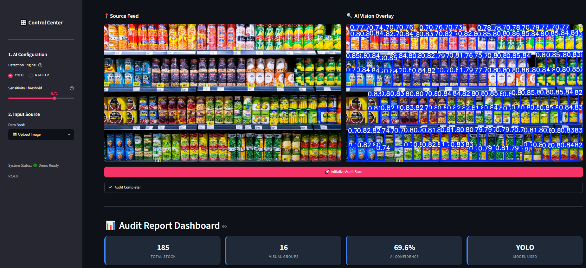
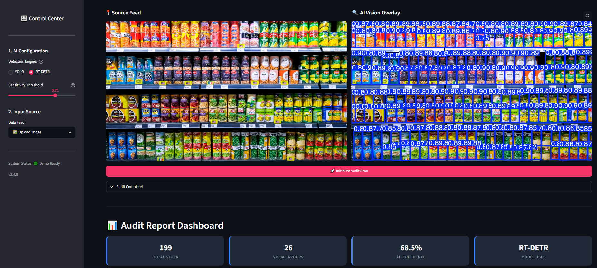
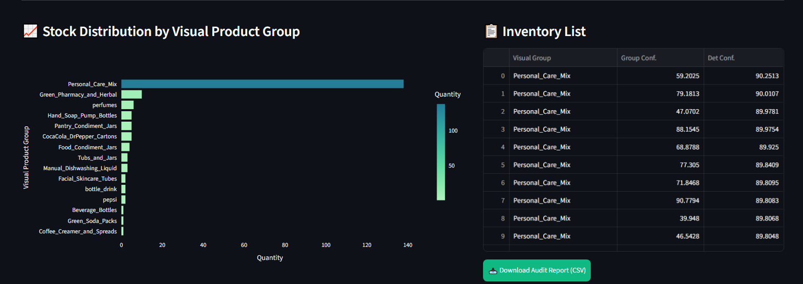
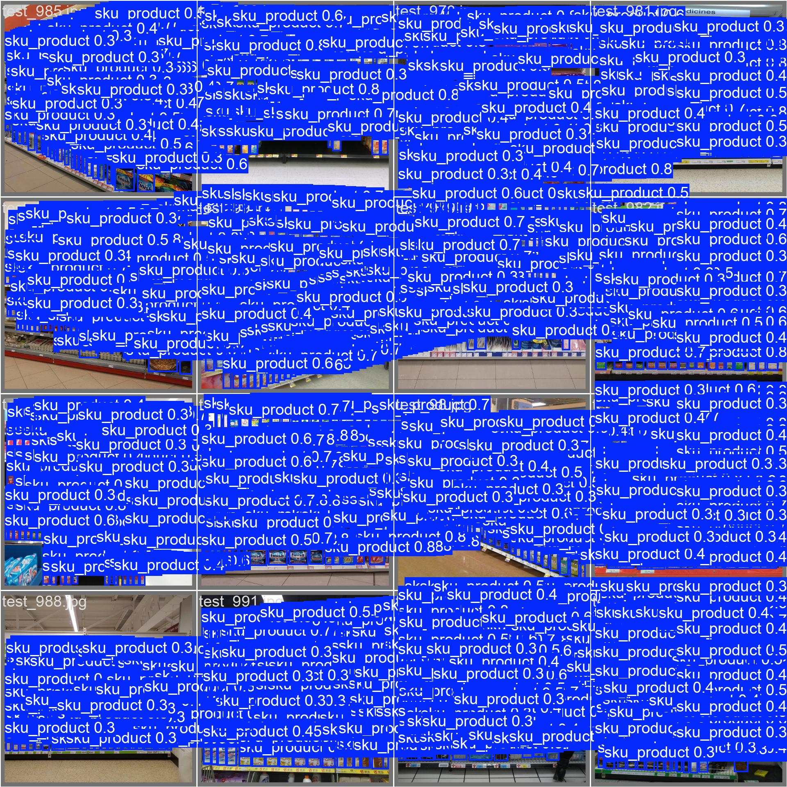
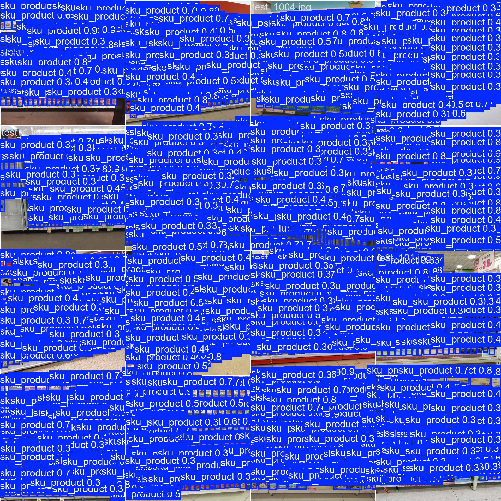
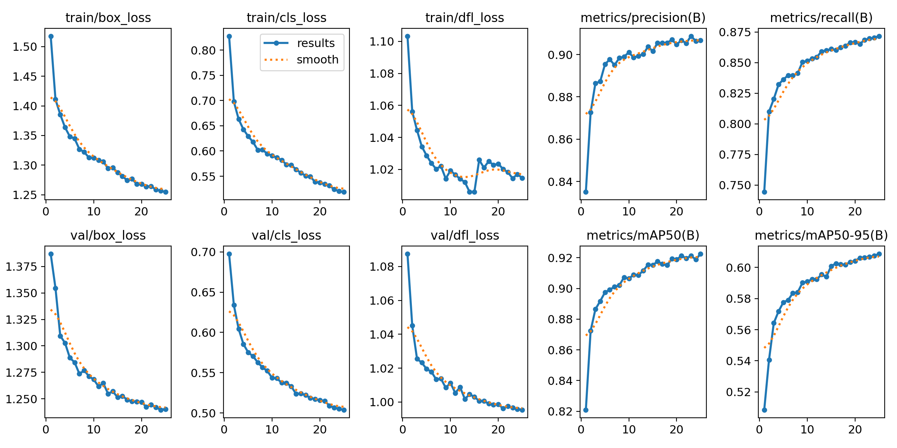
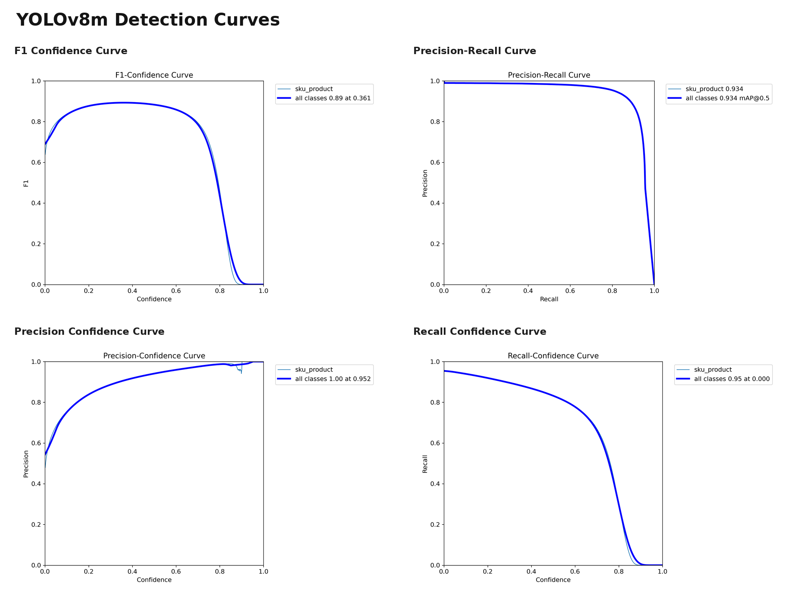
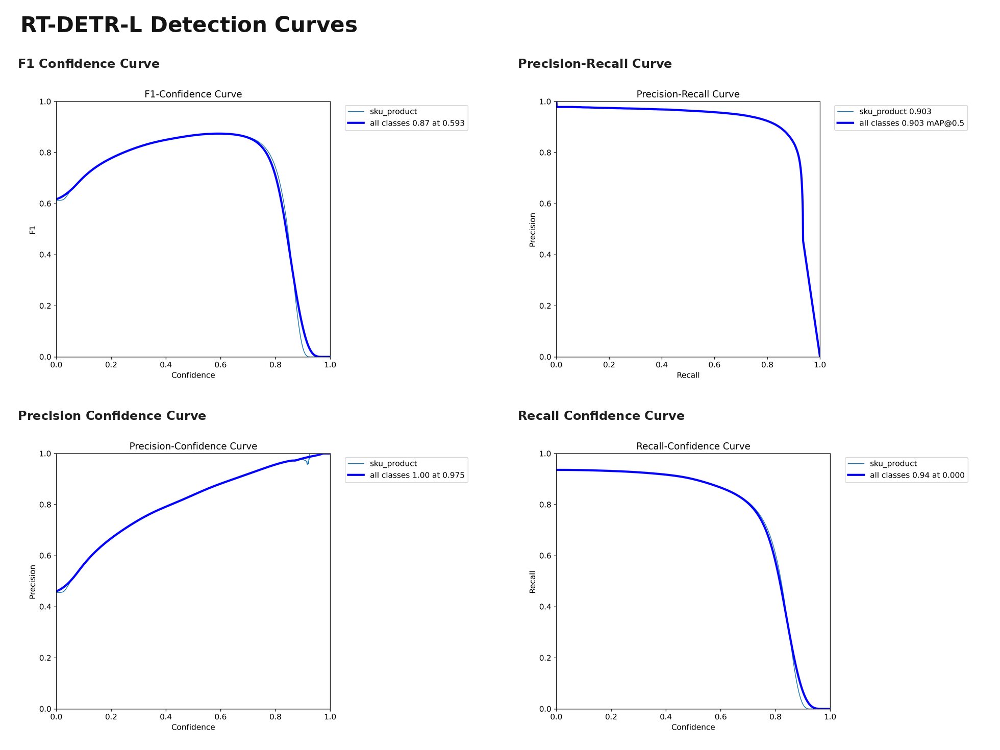
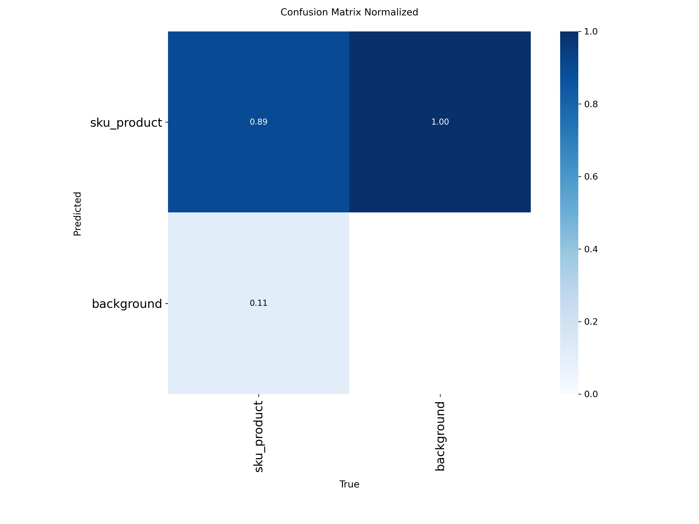
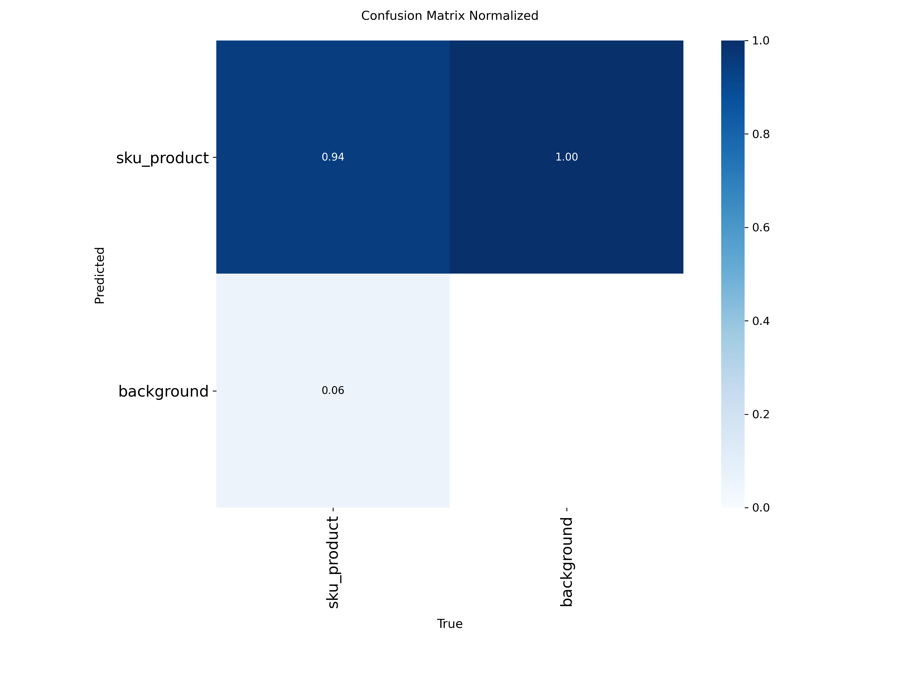

<div align="center">

# 🛒 Retail Shelf Dense Product Detection

### Dense Object Detection · Unsupervised Visual Pseudo-Labeling · Streamlit Inventory Auditing


</div>

---

## 📌 Overview

**Retail Shelf Dense Product Detection** is a computer vision system for detecting and auditing products in highly dense supermarket shelf images.

The project targets shelf scenes where a single image may contain **170–230 tightly packed product instances** under occlusion, scale variation, visual similarity, background clutter, and lighting variation.

The original detection dataset provided **single-class product bounding boxes** only. To move beyond one-class localization, this project introduces an unsupervised visual pseudo-labeling pipeline:

```text
Shelf Images
  → Single-class product bounding boxes
  → Product crop extraction
  → DINOv2 visual embedding extraction
  → Mini-Batch K-Means clustering
  → 91 visual product-group pseudo-labels
  → Optional crop-level classification
  → Streamlit inventory-auditing dashboard
```

This repository is structured as a clean public portfolio version of the original project.

---

## 📚 Public Repository Artifacts

| Artifact | Link | Purpose |
|---|---|---|
| Technical report | [reports/retail_shelf_object_detection_report.pdf](reports/retail_shelf_object_detection_report.pdf) | Full methodology, experiments, evaluation, limitations, and interface explanation |
| YOLOv8m training notebook | [notebooks/01_yolov8_training.ipynb](notebooks/01_yolov8_training.ipynb) | Cleaned YOLOv8m training reference without heavy outputs |
| RT-DETR-L training notebook | [notebooks/02_rtdetr_training.ipynb](notebooks/02_rtdetr_training.ipynb) | Cleaned RT-DETR-L training reference without heavy outputs |
| DINOv2 + K-Means pseudo-labeling overview | [notebooks/03_dinov2_kmeans_pseudo_labeling_overview.md](notebooks/03_dinov2_kmeans_pseudo_labeling_overview.md) | Public explanation of the unsupervised visual grouping pipeline |
| ResNet-50 visual group classification notebook | [notebooks/04_resnet50_visual_group_classification.ipynb](notebooks/04_resnet50_visual_group_classification.ipynb) | Cleaned optional classification experiment over 91 pseudo-labeled visual groups |
| YOLOv8m model card | [model_cards/yolov8m_detector.md](model_cards/yolov8m_detector.md) | Detector configuration, results, deployment notes, and limitations |
| RT-DETR-L model card | [model_cards/rtdetr_detector.md](model_cards/rtdetr_detector.md) | Transformer detector configuration, results, deployment notes, and limitations |
| ResNet-50 model card | [model_cards/resnet50_visual_group_classifier.md](model_cards/resnet50_visual_group_classifier.md) | Visual product-group classifier notes and limitations |
| Weights policy | [weights/README.md](weights/README.md) | Expected local model files and why weights are excluded from Git history |

---

## 🎯 Problem Statement

Retail shelf monitoring is more difficult than standard object detection because products are:

- Small and tightly packed
- Frequently occluded
- Visually similar
- Captured under different lighting conditions
- Captured from different distances and camera angles
- Mixed with cluttered shelf backgrounds
- Present in high object counts per image

The goal is to build a practical foundation for:

- Shelf monitoring
- Inventory auditing
- Product availability estimation
- Out-of-stock analysis
- Retail analytics dashboards
- Future SKU-level recognition systems

> This project is **not** a full commercial billing system, point-of-sale system, or guaranteed SKU-recognition engine. It is a dense object detection and visual product-group auditing prototype.

---

## 🚀 Key Contributions

- Built a dense retail product detection pipeline for supermarket shelf images.
- Benchmarked **YOLOv8m** and **RT-DETR-L** on a high-density retail object detection task.
- Extended a one-class detection dataset into **91 visual product groups** without manual category labeling.
- Used **DINOv2 embeddings** to represent cropped product instances based on visual similarity.
- Applied **Mini-Batch K-Means** to generate unsupervised visual pseudo-labels.
- Added an optional **ResNet-50 visual product-group classifier** over the generated pseudo-labels.
- Developed a **Streamlit dashboard** for image upload, model selection, detection visualization, stock summary, product-group distribution, and CSV export.
- Evaluated the system using mAP, Precision, Recall, F1-score, latency, model size, and deployment suitability.

---

## 🧠 Core Technical Idea

The original dataset was **not manually labeled into multiple product categories**.

Instead, the project used the object detection annotations to extract product crops, then created pseudo-labels through visual clustering.

```text
Original Dataset
  └── One generic product class

Our Extension
  ├── Crop products from bounding boxes
  ├── Extract DINOv2 visual features
  ├── Cluster crops using Mini-Batch K-Means
  └── Produce 91 visual product-group pseudo-labels
```

This makes the project stronger than a simple YOLO training task because it adds a scalable unsupervised strategy for turning one-class detection data into visual product-group supervision.

---

## 🏗️ System Architecture

```text
Input Shelf Image
  │
  ▼
Detection Engine
  ├── YOLOv8m
  └── RT-DETR-L
  │
  ▼
Bounding Box Postprocessing
  │
  ▼
Product Crop Extraction
  │
  ▼
Optional Visual Group Classification
  └── ResNet-50 over 91 pseudo-labeled product groups
  │
  ▼
Inventory Aggregation
  │
  ▼
Streamlit Audit Dashboard
  │
  ▼
CSV Export
```

---

## 🧩 Methodology

### 1. Dense Product Detection

Two detection architectures were trained and compared:

| Model | Role |
|---|---|
| **YOLOv8m** | Main deployment-oriented one-stage detector |
| **RT-DETR-L** | Transformer-based comparison detector |

YOLOv8m was selected as the preferred model because it provided the best balance of accuracy, speed, model size, and deployment practicality.

---

### 2. Unsupervised Visual Pseudo-Labeling

The dataset originally treated all products as one class. To create a richer inventory-auditing layer, product crops were extracted from bounding boxes.

The pseudo-labeling process:

```text
Product bounding boxes
  → Product crops
  → Crop filtering
  → DINOv2 visual embeddings
  → Mini-Batch K-Means clustering
  → Mosaic-based cluster inspection
  → 91 visual product groups
```

### Why DINOv2?

DINOv2 was selected because the task depends on fine-grained visual similarity such as:

- Package shape
- Texture
- Color layout
- Edges
- Small visual details
- Product appearance patterns

This is more suitable than text-image semantic matching when product captions or true SKU names are not available.

---

### 3. Optional Visual Group Classification

A ResNet-50 classifier was trained on the generated 91 pseudo-labeled visual groups.

This stage should be interpreted as:

```text
Visual product-group classification
```

not as:

```text
Confirmed commercial SKU recognition
```

The classification layer is useful for inventory-style grouping and dashboard analytics, but it is not a replacement for a real retail SKU database.

---

## 📊 Detection Results

| Model | mAP@50 | mAP@50-95 | Precision | Recall | F1-score | Avg. Inference |
|---|---:|---:|---:|---:|---:|---:|
| **YOLOv8m** | **0.9359** | **0.6185** | **0.9079** | **0.8828** | **0.8952** | **~38 ms** |
| RT-DETR-L | 0.9029 | 0.5933 | 0.8793 | 0.8702 | 0.8748 | ~70 ms |

### Main Finding

**YOLOv8m** achieved the strongest overall balance:

- Higher localization performance
- Higher precision
- Higher recall
- Higher F1-score
- Faster inference
- Smaller model footprint
- Better deployment suitability

RT-DETR-L remained useful as a transformer-based comparison model, but its higher latency made it less attractive for fast shelf-auditing scenarios.

---

## 🧪 Training Setup

| Component | Configuration |
|---|---|
| Image size | 640 × 640 |
| Dataset domain | Dense supermarket shelf images |
| Original detection classes | 1 generic product class |
| Generated visual groups | 91 pseudo-labeled groups |
| YOLOv8m best optimizer | AdamW |
| YOLOv8m best learning rate | 0.0005 |
| YOLOv8m batch size | 8 |
| RT-DETR-L best optimizer | AdamW |
| RT-DETR-L best learning rate | 0.0005 |
| RT-DETR-L batch size | 8 |
| Final training epochs | 25 |

---

## 🖥️ Streamlit Demo

The project includes an interactive Streamlit dashboard for retail shelf auditing.

### Demo Capabilities

- Upload a shelf image
- Select detection engine: **YOLOv8m** or **RT-DETR-L**
- Adjust confidence threshold
- Display original image and AI overlay side by side
- Draw bounding boxes around detected products
- Estimate total detected stock
- Show visual product-group distribution
- Display inventory-style table
- Export audit results as CSV

### Streamlit Demo Preview

The Streamlit dashboard was tested locally with the YOLOv8m, RT-DETR-L, and optional ResNet-50 visual product-group classifier weights placed under the local `weights/` directory.

| YOLOv8m Demo | RT-DETR-L Demo |
|---|---|
|  |  |

#### Inventory Dashboard



### Visual Result Assets

The public repository also includes qualitative detection samples and evaluation visualizations for both YOLOv8m and RT-DETR-L.

#### Qualitative Detection Samples

| YOLOv8m Dense Shelf Prediction | RT-DETR-L Dense Shelf Prediction |
|---|---|
|  |  |

#### YOLOv8m Training Metrics



#### Detection Curves

| YOLOv8m Detection Curves | RT-DETR-L Detection Curves |
|---|---|
|  |  |

<details>
<summary>Normalized Confusion Matrices</summary>

| YOLOv8m | RT-DETR-L |
|---|---|
|  |  |

</details>

---

## 📁 Repository Structure

```text
retail-shelf-dense-product-detection/
│
├── app/
│   ├── bootstrap.py
│   └── streamlit_app.py
│
├── src/
│   └── retail_shelf_ai/
│       ├── __init__.py
│       └── streamlit_utils.py
│
├── configs/
│   └── .gitkeep
│
├── notebooks/
│   ├── 01_yolov8_training.ipynb
│   ├── 02_rtdetr_training.ipynb
│   ├── 03_dinov2_kmeans_pseudo_labeling_overview.md
│   └── 04_resnet50_visual_group_classification.ipynb
│
├── assets/
│   ├── streamlit_yolo_demo.png
│   ├── streamlit_rtdetr_demo.png
│   ├── streamlit_inventory_dashboard.png
│   ├── yolo_prediction_sample.jpg
│   ├── rtdetr_prediction_sample.jpg
│   ├── yolo_training_results.png
│   ├── yolo_detection_curves.png
│   ├── rtdetr_detection_curves.png
│   ├── yolo_confusion_matrix_normalized.png
│   └── rtdetr_confusion_matrix_normalized.png
│
├── reports/
│   └── retail_shelf_object_detection_report.pdf
│
├── model_cards/
│   ├── yolov8m_detector.md
│   ├── rtdetr_detector.md
│   └── resnet50_visual_group_classifier.md
│
├── scripts/
│   └── .gitkeep
│
├── weights/
│   ├── .gitkeep
│   └── README.md
│
├── NOTICE.md
├── packages.txt
├── requirements.txt
├── .gitignore
└── README.md
```
---

## Linux / Codespaces System Dependencies

Some Linux environments require OpenCV system libraries before importing `cv2` or `ultralytics`.

For Codespaces or Debian/Ubuntu-based environments:

```bash
sudo apt-get update
sudo apt-get install -y libgl1 libglib2.0-0
```

This repository also includes a `packages.txt` file for environments that support installing system packages from a package list.

---

## ⚙️ Installation

```bash
git clone https://github.com/Adnanwadee/retail-shelf-dense-product-detection.git
cd retail-shelf-dense-product-detection

python -m venv .venv
```

### Linux / macOS

```bash
source .venv/bin/activate
```

### Windows PowerShell

```powershell
.venv\Scripts\Activate.ps1
```

### Install dependencies

```bash
pip install -r requirements.txt
```

---

## ▶️ Run the Streamlit App

```bash
streamlit run app/streamlit_app.py
```

Expected local URL:

```text
http://localhost:8501
```

---

## 🧱 Model Weights

Model weights are not stored directly inside the repository to keep Git history clean and avoid large binary files.

Expected local structure:

```text
weights/
├── best_yolo.pt
├── best_rtdetr.pt
└── resnet50_best.pth
```

Recommended distribution options:

- GitHub Releases
- Hugging Face model repository
- Google Drive link
- Private download link for demonstration only

---

## 🔐 Publication and Protection Policy

This repository is intended as a clean public portfolio version.

### Included

- Project documentation
- Streamlit demo code
- Training notebooks
- Evaluation plots
- Model cards
- Technical report
- Sample inference assets

### Excluded

- Full raw dataset
- Large prediction JSON files
- Private experiments
- API keys
- Environment files
- Model weights inside Git history
- Unclean training cache files

---

## ⚠️ Technical Notes

- The original detection dataset used a **single generic product class**.
- The 91 groups are **unsupervised visual pseudo-labels**, not manually verified commercial SKU labels.
- DINOv2 was used for crop-level visual embeddings.
- Mini-Batch K-Means was used for visual clustering.
- The ResNet-50 classifier is an optional visual grouping extension.
- The detection system is the core technical contribution.
- The Streamlit dashboard is a prototype for visual shelf auditing.

---

## ❗ Limitations

- The system currently works on static images, not continuous video streams.
- Visual product groups are not guaranteed to match real-world SKU identities.
- Very dense shelves and severe occlusion may still produce missed detections.
- Classification quality depends on detection crop quality.
- No real retail product database is integrated.
- No pricing, billing, checkout, or POS integration is included.
- Production deployment would require store-specific validation and real SKU mapping.

---

## 🔮 Future Work

- Add verified SKU-level labels linked to a real product database.
- Improve fine-grained product-group classification.
- Add video-based shelf monitoring and temporal tracking.
- Deploy the Streamlit demo online.
- Add ONNX / TensorRT export for faster inference.
- Add barcode or product metadata integration.
- Add structured audit report generation.
- Improve detection for extremely small and heavily occluded products.
- Add automated model download script.

---

## 🛠️ Tech Stack


---

## 📌 Project Status

Current status:

```text
Public portfolio showcase version complete.
```

Completed:

- Dense object detection training
- YOLOv8m and RT-DETR-L benchmarking
- DINOv2 + K-Means visual pseudo-labeling methodology
- 91 visual product-group generation
- Optional ResNet-50 visual group classification experiment
- Streamlit audit dashboard prototype
- Local demo validation with YOLOv8m, RT-DETR-L, and ResNet-50 weights
- Technical report
- Cleaned public notebooks
- Public visual result assets
- Model cards
- Weights and publication policy documentation

Intentionally excluded from Git history:

- Trained weights
- Full datasets
- Derived crop datasets
- Raw experiment archives
- Large prediction files

---

## Publication Notice

This repository is published as a public portfolio and academic project showcase.

No open-source license is currently granted. All rights are reserved unless explicitly stated otherwise.

The public repository includes documentation, cleaned notebooks, visual result assets, model cards, and a Streamlit demo interface. Trained model weights, full datasets, derived crop datasets, large prediction files, and raw experiment archives are intentionally excluded from Git history.

For details, see [NOTICE.md](NOTICE.md).

---

## 📄 Disclaimer

This project is an academic and portfolio computer vision prototype.

It is **not**:

- A commercial billing system
- A production inventory management platform
- A guaranteed SKU-recognition engine
- A replacement for a verified product database

Dataset ownership is not claimed. Dataset usage should follow the terms of the original dataset provider.

---

## 👤 Author

**Adnan Wadee Abdullah**  
Applied AI Engineer — Computer Vision · NLP Transformers · LLM/RAG Systems · Explainable AI

[](https://github.com/Adnanwadee)
[](https://www.linkedin.com/in/adnan-abdullah-5a263b300)
[](mailto:eng.adnanabdullah22@gmail.com)

---

<div align="center">

**Built as a dense computer vision system for retail shelf understanding, visual grouping, and deployment-oriented AI demonstration.**

</div>
